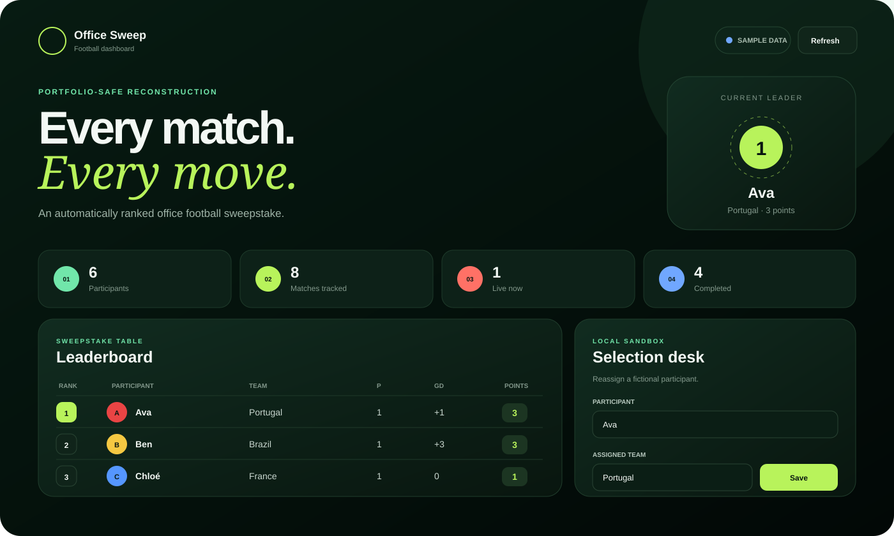

# Football World Cup Sweepstake Dashboard

A portfolio-safe reconstruction of an internal office football sweepstake application. It demonstrates participant-to-team assignments, match ingestion, automatically calculated standings, live-status handling, local selection changes, and timed refreshes in a responsive browser interface.

> This repository is a reconstruction because the original internal source files were not available during the portfolio audit. All participant names and match results included here are fictional. No employer, applicant, customer, or operational data is included.



## What it demonstrates

- Responsive dashboard built with HTML, CSS, and modern JavaScript
- Configurable football match API integration through a Netlify function
- Automatic fallback to bundled fictional sample data
- Participant leaderboard calculated from assigned-team results
- Live, completed, and scheduled match filtering
- Locally saved sweepstake selections with a reset option
- Automatic refresh every 60 seconds
- Dependency-free scoring logic with Node test coverage

## Run locally

The project has no production dependencies. Serve the folder through any local static server:

```bash
python -m http.server 4173
```

Then open `http://localhost:4173`.

Run the scoring tests with:

```bash
npm test
```

## Optional live data

The dashboard works without credentials by using `data/sample-matches.json`. For live data on Netlify:

1. Create a football-data.org API token.
2. Add it to Netlify as `FOOTBALL_DATA_API_TOKEN`.
3. Deploy the repository.

The token stays in the serverless function and is never sent to the browser. If the API is unavailable, the interface falls back to sample data and clearly labels the active source.

## Scoring

The demo uses conventional group-stage points for each participant's assigned team:

- Win: 3 points
- Draw: 1 point
- Loss: 0 points

Ties are ordered by goal difference, goals scored, and then participant name.

## Privacy and ownership

- Fictional people and sample scores only
- No SGS/NTA branding, internal data, or confidential workflow details
- No FIFA logos or protected visual assets
- Not affiliated with FIFA, SGS, NTA, football-data.org, or any national football association
- No open-source licence is granted unless a licence file is added later

## Project status

Portfolio demonstration. It is suitable for showing front-end development, API integration, state handling, and automation concepts. Shared multi-user editing, authentication, audit history, and an administrative backend would be required for production use.

